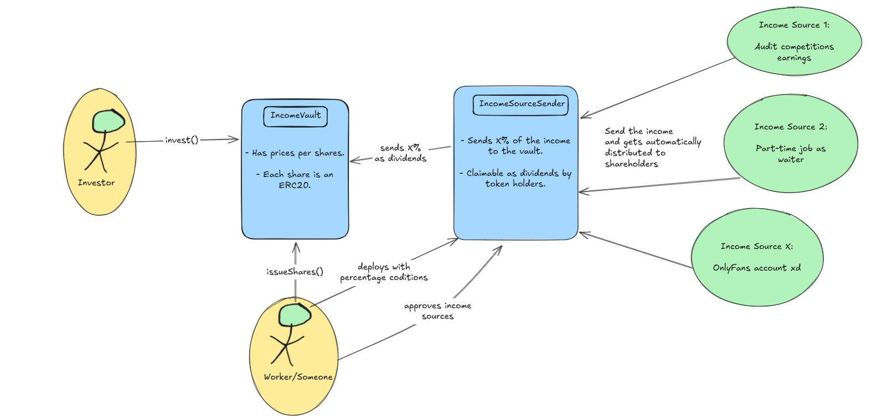

# Only-Investors 🧑‍🦲📈💰  
### Fostering Talent

---

## Because Financial Stability Builds a Better Future  

Welcome to **Only Investors**, a platform designed to enable investments in **people as income sources**.  

Our Motto: *Fostering Talent.*  

### How It Works  

Only Investors provides a simple, powerful, and beautiful way to invest in individual talent and earn from their success:  

1. **The Worker Creates Tokens**:  
   - A worker (e.g., a smart contract auditor) issues their own **reward tokens** to represent a share of their future income.  

2. **Investors Buy Tokens**:  
   - As an investor, you can purchase these tokens, providing the worker with upfront income to enhance their capabilities and opportunities.  

3. **Shared Earnings**:  
   - Token holders receive a percentage (**X%**) of the worker’s future income. For example, payouts directed to the worker's address can automatically route a portion of the funds to token holders via a smart contract, ensuring transparency and accountability.  

---

### Why It Matters  

Workers define their own terms, and you decide whether to invest based on their proposed profitability and potential. Here’s why this model benefits everyone:  

- **For Investors**: Gain a stake in someone’s future success, diversifying your portfolio with income-based assets.  
- **For Workers**: Secure the financial stability to invest in themselves, creating better products and opportunities without the pressure of immediate returns.  

Like buying stock in a company, you’re investing in someone’s potential. Sure, there’s risk—people, like companies, might not perform as expected. But with this model, we democratize access to capital at an individual level, improve efficiency, and create opportunities for talented workers worldwide.  

---

### Vision: A More Thoughtful World  

Imagine a world where talented individuals can focus on their craft, free from financial strain, and investors earn returns by supporting meaningful work. That’s the future Only Investors aims to create: **happier, more relaxed, and more productive workers delivering better results.**  

See more technical details in the [Developer Docs](./developerDocs/README.md).

---

## Project Goal  

To establish a decentralized public infrastructure for investing in income sources, empowering individuals, and optimizing capital efficiency.  

---

Join us in shaping a fairer, more collaborative future for talent and investment!

## Other implementations

- Solana version: [OnlyInvestors-Solana](https://github.com/CarlosAlegreUr/OnlyInvestors-Solana)
- Starknet version: [OnlyInvestors-Starknet](https://github.com/CarlosAlegreUr/OnlyInvestors-Starknet)
