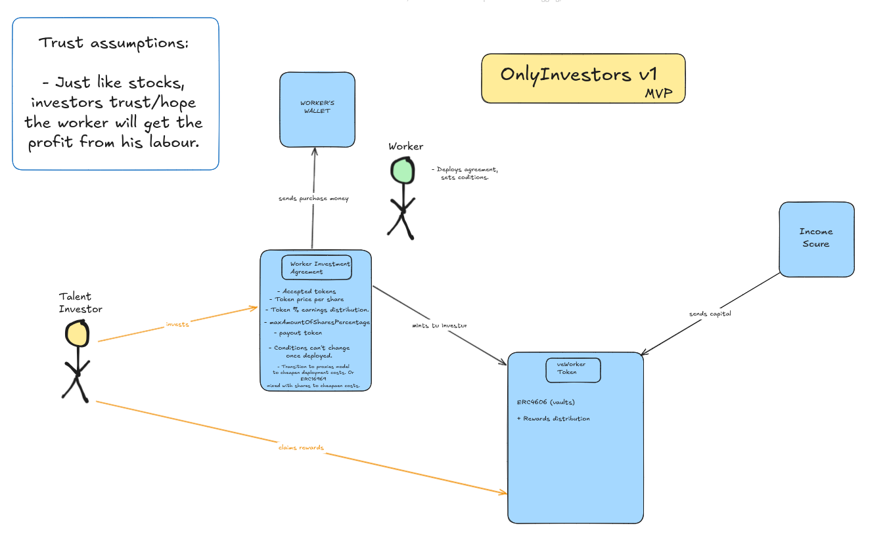

# Only-Investors 🧑‍🦲📈💰
### Fostering talent.

---

Because **financial stability** allows you to plan a **better future**. Here I present:

Only Investors
(Motto: Fostering talent)

A platform to invest on People (generally, income sources).

This is how it works, simple, powerful, beautiful:

1.- Some worker (let’s say a smart contract auditor) creates its own rewards token.

2.- You as an investor can buy that token. (the worker gets some income, the worker sets the price)

3.- You will get X% of the worker’s future income which will be distributed to reward token holders. (auditors usually receive their payouts at a certain address, the address can perfectly be a smart contract that redirects X% of the funds to investors to assure payouts)

Workers will set the conditions of profitability of their future work, and if you deem them nice, just buy the tokens, get your share and wait until your investment yields profit. In the meanwhile, the worker will have more capital to invest on himself, his work and overall leading to a more thoughtful and cared product created by a relaxed and stable worker.

Sure the worker can always laze around and do a shit, but this is like buying a stock, giving money to the company in expect of future returns, the company can just do shit too.

Let’s democratize access to capital at an individual level and improve the capital efficiency while promoting happier talented workers around the world!

---

## Project Goal

This aims to be public-infrastructure to decentralize investment on income sources.
